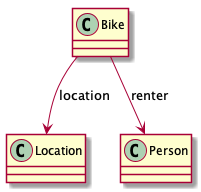
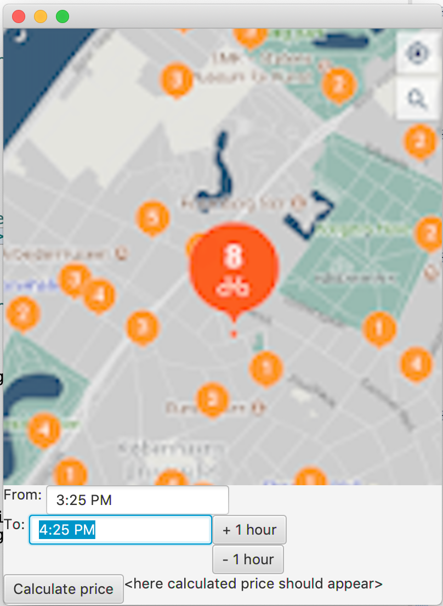

# Bike rental app

Temaet for oppgaven er administrasjon av sykkelutleie. Sykkelutleietjenesten [BikeRental](BikeRental.java) tilbyr leie av sykler (Bike)[Bike.java] som plukkes opp og settes tilbake på utvalgte stasjoner spredt rundt omkring. Syklene har GPS, slik at de hele tiden spores (GeoLocation)[GeoLocation.java].

Den som skal leie sykkel (Person)[Person.java] bruker en app for å få oversikt over hvor (ved hvilke stasjoner) det er tilgjengelige sykler. Deretter er det bare å identifisere sykkelen, angi hvor lenge man ønsker å leie den, og en kan sykle av gårde. Når en er ferdig med å bruke sykkelen, må den settes tilbake på en stasjon (ikke nødvendigvis den samme som en tok den fra). Ved hjelp av appen angir man at leieforholdet er avsluttet. Leieprisen blir da beregnet og pengene trukket.
 
Prisen er basert på påbegynte timer, og merk at en ikke betaler for mer enn faktisk bruk. Hvis man altså angir at en ønsker å leie en sykkel i tre timer, men leverer den tilbake etter en halv time, så betaler en for én times bruk.

Det er mulig å utvide leietiden underveis, noe som utløser et lite gebyr. Hvis en utvider leietiden eller leverer sykkelen etter at sykkelen skulle vært levert, så påløper det også et gebyr.

Del 1 av oppgaven fokuserer på administrasjon av leieforholdet. Del 2 fokuserer på å gjøre det lettere å bytte måten prisen beregnes. Del 3 handler om en mobil-app for å beregne pris.

Som nevnt i innledning til oppgavesettet skal all koden leveres samlet. Deloppgavene er laget som en hjelp til å ta én ting om gangen i en naturlig rekkefølge, men du bør se på det som en helhet. 

## Del 1 - BikeRental-, Bike-, og Location-klassene

BikeRental-klassen administrerer stasjonene, syklene og utleieforhold. Vi gjør det enkelt og identifiserer stasjonene med et geografisk punkt (GeoLocation, se skjelettet), altså lengde- og breddegrad. GeoLocation brukes også for lagring av posisjonen til syklene.

- Skriv ferdig double distance(GeoLocation)-metoden i GeoLocation.

Bike-klassen skal ha assosiasjoner (koblinger) til Person- (se skjelettet) og GeoLocation-klassene iht. følgende klassediagram:

Begge disse assosiasjonene er dynamiske, dvs. både location og renter (låntaker) kan endres. location-koblingen endres (automagisk, du kan bare forholde deg til at location hele tiden oppdateres) når sykkelen beveger seg, mens renter-koblingen endres når leieforhold innledes og avsluttes.

- Skriv felt og metoder for location- og renter-assosiasjonene iht. Java sine kodingskonvensjoner.

BikeRental må holde oversikt over alle stasjonene, representert med GeoLocation, og alle syklene (Bike).

- Skriv nødvendige variabel-deklarasjoner (felt) for dette og forklar hva som styrer valget av typer. Hvis du trenger metoder for å konfigurere systemet med stasjoner og sykler, f.eks. for testformål, så skriv gjerne slike, men det er ikke en del av oppgaven.

I første omgang kan du forenkle koden for leie og retur av sykler, ved å ikke ta hensyn til annet enn start- og slutt-tidspunkt for leieforholdet. Forlenging av leie kan kommer i del 2. `renter`-assosiasjonen i Bike skal holde rede på hvem (Person) som evt. leier en sykkel (Bike). Du bestemmer selv hvor/hvordan du vil representere når leieforholdet starter og når det forventes at sykkelen leveres tilbake. Det viktigste er at informasjonen kan brukes når sykkelen leveres og leien skal beregnes og betales.

Skriv metodene under i klassen BikeRental. Disse metodene bygger på representasjonen du valgte over.

- countAvailableBikesNearby - teller hvor mange ledige sykler det er innen en viss avstand (hjelper en potensiell låner (renter) å finne ut om det er sykler i nærheten)
- getStationNearby – finner (lokasjonen til) stasjonen som er nærmest en sykkel og innenfor en viss minimumsavstand (hjelper en låner (renter) å finne ut hvor en sykkel kan settes tilbake)
- getRentedBikes – returnerer alle syklene som er lånt ut
- getUnreturnedBikes – returnerer alle syklene som er plassert ved en stasjon, men som fortsatt er knyttet til en låner (renter)  (brukes når en skal sende varsler til de som har satt fra seg sykkelen, men glemt å angi den som levert)

Skriv metodene `rentBike` og `returnBike` i klassen BikeRental (se javadoc for detaljene, merk spesielt krav om utløsing av unntak). Disse metodene endrer tilstanden som brukes av de foregående metodene. Velg selv passende unntakstype(r). `LocalDateTime` brukes for å representere tid (erstatter Date i moderne Java).

- rentBike – kalles når en person starter å leie en gitt sykkel
- returnBike – kalles når en person leverer tilbake sykkelen og betaler for leien (i denne oppgaven skal pris være 10 kr. pr. påbegynte time)

BikeRental-klassen skal utvides til å støtte forlengelse av leie, beregning av gebyrer for forlengelse og for å forlenge eller levere tilbake sykkelen etter angitt tid.

- Gjør nødvendige endringer av rentBike- og returnBike-metodene i BikeRental, iht. de nye kravene nevnt over, og skriv i tillegg extendRental-metoden. Baser deg på en pris på 10 kr. pr. påbegynte time (som over), 5 kr. pr. forlengelse og 10 kr. pr. for sen forlengelse eller tilbakelevering.

## Del 2 - Fleksibel beregning av pris

Det er ønskelig å gjøre håndtering av pris fleksibel, så endringer i liten (eller ingen) grad krever endringer i koden. F.eks. kan det være aktuelt å introdusere abonnement, kortvarige kampanjer og/eller ulike typer fremkomstmidler med egne priser. Koden bør dermed gjøres mer fleksibel.

Velg én eller flere av disse mulighetene, og realiser en løsning som gir en ryddig programstruktur. Du står fritt i utforming av løsningen, men husk at hensikten er å vise at du kan trekke inn en eller flere relevante og mer avanserte teknikker. Du blir ikke vurderte ut fra mengden kode, men god og fornuftig bruk av teknikkene.

## Del 3 - Mobil-app

Det skal lages en mobil-app for utleietjenesten og i første omgang fokuseres det på beregning av pris. Man skal kunne angi uthentings- og innleveringstidspunkt og få beregnet prisen.

Under ser du et utkast til en mobil-app for sykkelutleietjenesten, basert på FXML. Kartet viser hvor det er sykler, og én stasjon er valgt (og implisitt også en sykkel på stasjonen). Brukeren kan endre antatt tidspunkt for tilbakelevering ved å endre teksten i tekstfeltet eller bruke knappene til høyre for feltet.

Prototypen er laget vha. FXML og noe Java, og nå er det din jobb å fullføre den!

- Legg først til de Java-elementene (klasser, felt og metoder) som må finnes i koden som implementerer oppførselen (logikken) til appen
- Skriv koden som er nødvendig for å vise frem prisen, når tilsvarende knapp trykkes!
